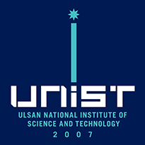
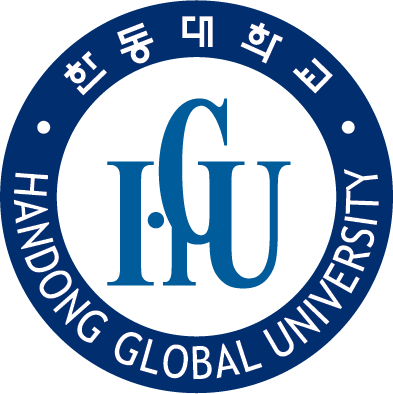

# Education

 

**Gwangju Institute of Science and Technology (GIST)**
  

**M.S Student in Artificial Intenlligence Graduate School** 
 

**March 2022 - February 2024 (Expected)** 

 

**Ulsan National Institute of Science and Technology (UNIST)**
 

**Master Student in Artificial Intenlligence Graduate School**
 

**August 2021 - February 2022 (drop out)**

 

**Handong Global University**
 

**Bachelor of Science in Computer Science and Life Science (double major)**
 

**February 2016 - February 2021**
